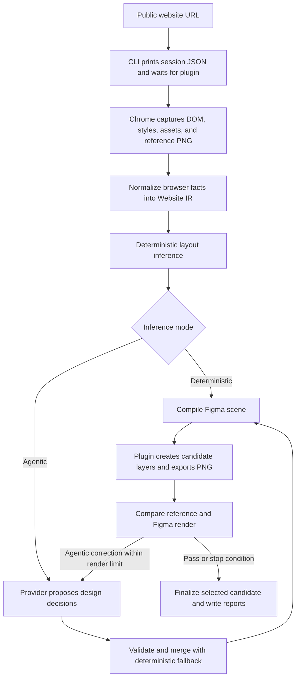

# Website-to-Figma Agent Pipeline

Convert a public website into editable Figma layers, with captured browser evidence,
optional AI inference, and visual QA. The project is intended as a local tool for
frontend development: inspect an existing design, customize it in Figma, and retain
the source evidence needed for further work.

Deterministic mode is the default. Agentic mode is opt-in through a provider-neutral
adapter, with local Codex currently implemented. Website generation from a customized
Figma design is a future feature.

The broader goal of this pipeline is to reverse-engineer existing websites into an editable design representation where users can apply their own stylistic choices. This forms one half of a bidirectional agentic workflow. By preserving both the original browser evidence and the resulting Figma structure, an agent can gain enough context from the Figma domain to accurately regenerate the customized design as a functional webpage.

## Pipeline overview



1. **Connect and capture.** The live run waits for the Figma plugin before opening
   the page. Chrome captures one page at a 1440×900 viewport, including its full
   document height within capture limits.
2. **Normalize and infer.** Raw browser facts remain separate from design intent.
   Deterministic inference establishes a baseline; agentic mode adds validated
   proposals for layout, naming, typography, components, and other supported intent.
3. **Compile and import.** The scene compiler produces source-linked instructions.
   The plugin imports text, images, vectors, and scoped media fallbacks into the
   selected Figma page.
4. **Compare and correct.** PNG comparison measures SSIM and changed pixels.
   Agentic mode can render up to three candidates, stopping on a pass, lack of
   improvement, failure, or a configured limit, then selecting the best completed
   candidate. Strict pixel QA requires SSIM ≥0.95 and changed pixels ≤5%.
5. **Report.** Each run saves artifacts, diagnostics, visual QA, and, in agentic
   mode, decision history and provider-reported token usage.

Some inferred fields are currently scene metadata and do not yet become native
Figma Auto Layout, components, or responsive constraints. See
[current limitations](docs/limitations.md) and the
[acceptance checklist](docs/smoke-test.md) for release status.

## Getting started

### 1. Install and build

The current CLI expects **macOS with Google Chrome installed in `/Applications`**,
**Figma Desktop**, **Node.js 22–26**, and **npm 11**. Agentic mode additionally needs
an installed, authenticated Codex CLI; deterministic mode does not use a model.

```sh
git clone https://github.com/StevenPDang/design-reverse-engineering-agent.git
cd design-reverse-engineering-agent
npm install
npm run build
npm run package:plugin
```

### 2. Load the Figma plugin

1. Open the destination design document and page in Figma Desktop.
2. Choose **Plugins → Development → Import plugin from manifest**.
3. Select `apps/figma-plugin/dist/plugin/manifest.json` from this repository.
4. Run **Website to Figma Importer** from the Development menu.

Rebuild and reload the development plugin after updating the project.

### 3. Start an import and connect

```sh
node apps/cli/dist/src/index.js import 'https://example.com/'
```

The CLI prints a temporary **session JSON** and waits for a connection. Paste that
JSON into the plugin and choose **Connect and import into this page**. Capture
starts after connection; keep the plugin open until the run finishes. Use a new
CLI run and reopen the plugin for each new import.

Quote URLs, especially those containing `?` or `&`, to avoid shell parsing errors.
The session token is temporary and should not be shared or committed. If you need
more time to connect, add `--plugin-timeout 300`.

### 4. Optionally enable agentic inference

With the Codex CLI installed and authenticated:

```sh
node apps/cli/dist/src/index.js import 'https://example.com/' \
  --inference agentic --provider local-codex --max-renders 3
```

The adapter proposes decisions in a read-only Codex session. Invalid output or a
provider failure falls back to deterministic inference. Defaults are three renders,
120 seconds per provider call, and a 2,000,000-byte provider output limit.
These limits are **not a hard token-spending cap**; inspect reported usage before
scaling up runs. See [detailed setup and controls](docs/getting-started.md).

To capture and compile artifacts without connecting to Figma:

```sh
node apps/cli/dist/src/index.js import 'https://example.com/' --capture-only
```

Add `--inference agentic` to also invoke the provider in capture-only mode.
Capture-only does not import layers or perform Figma visual QA.

### 5. Review the results

Open `.artifacts/latest-run.md` for the latest human-readable report. Each run also
writes to `.artifacts/<run-id>/`, or a directory supplied with `--output <dir>`.
Use a fresh output directory for each run.

| Output                                                    | Contents                                                  |
| --------------------------------------------------------- | --------------------------------------------------------- |
| `run-report.md`                                           | Import counts, diagnostics, visual scores, and next steps |
| `raw-capture.json`, `website-ir.json`                     | Captured browser facts and normalized structure           |
| `inference.json`, `figma-scene.json`                      | Inference decisions and compiled scene                    |
| `reference.png`, `figma.png`                              | Browser reference and Figma export, when available        |
| `assets/`, `import-result.json`, `qa-report.json`         | Captured assets, node results, and QA measurements        |
| `deterministic-inference.json`, `correction-history.json` | Agentic baseline, pass history, decisions, and usage      |

Exit code **0** means import and QA passed; **2** means partial results, failed QA,
or capture-only; **1** means a fatal error. Review the visual result as well as the
scores. Missing exports produce explicitly labeled QA placeholders.

The current scope is one public, unauthenticated page. Multi-viewport capture,
interaction-state capture, and frontend code generation are future proposals.
For troubleshooting, consult [getting started](docs/getting-started.md) and
[limitations](docs/limitations.md).

## Verification

```sh
npm test
npm run test:coverage
npm run test:integration
npm run test:e2e
npm run build
npm run typecheck
npm run lint
npm run format:check
npm run validate:schemas
npm run package:plugin
```
